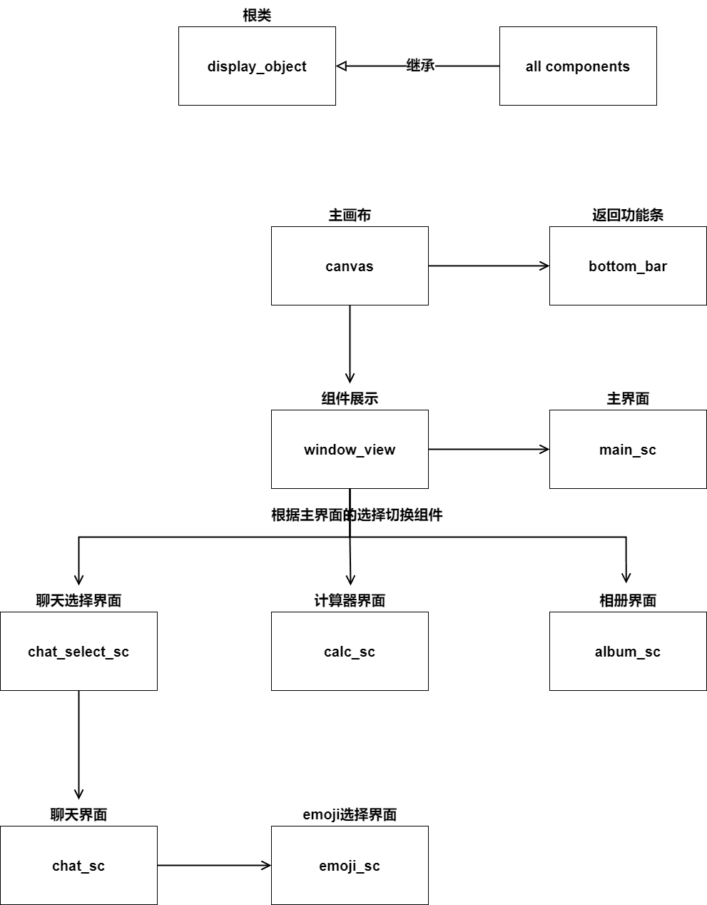
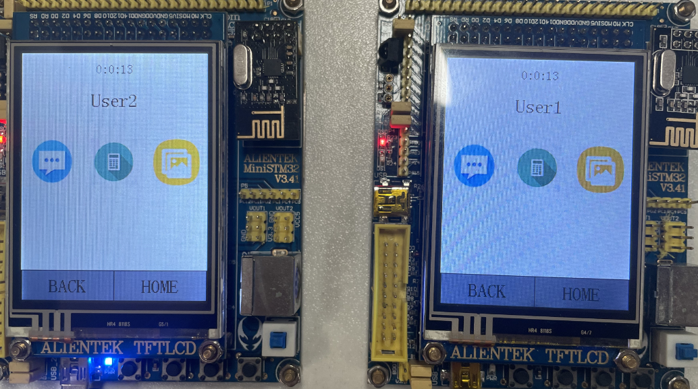
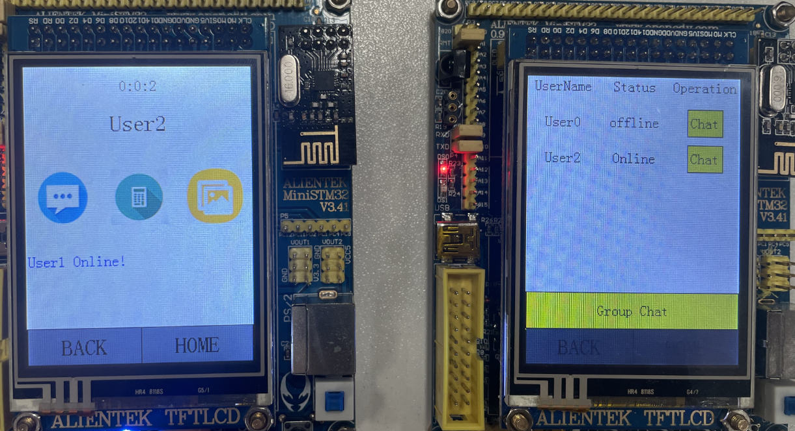
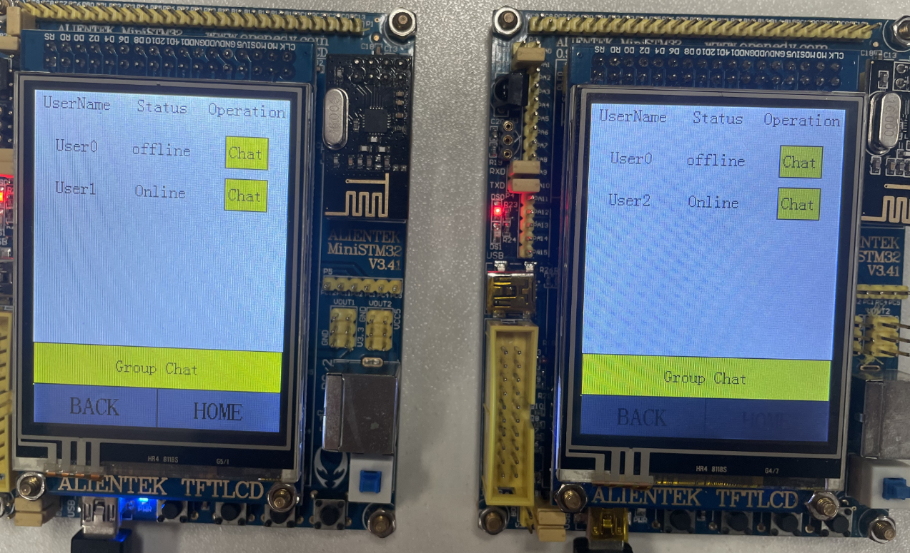
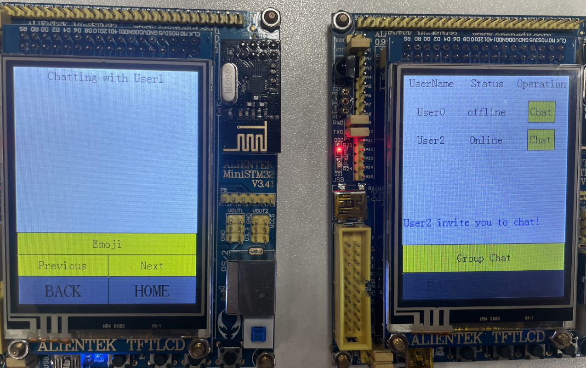
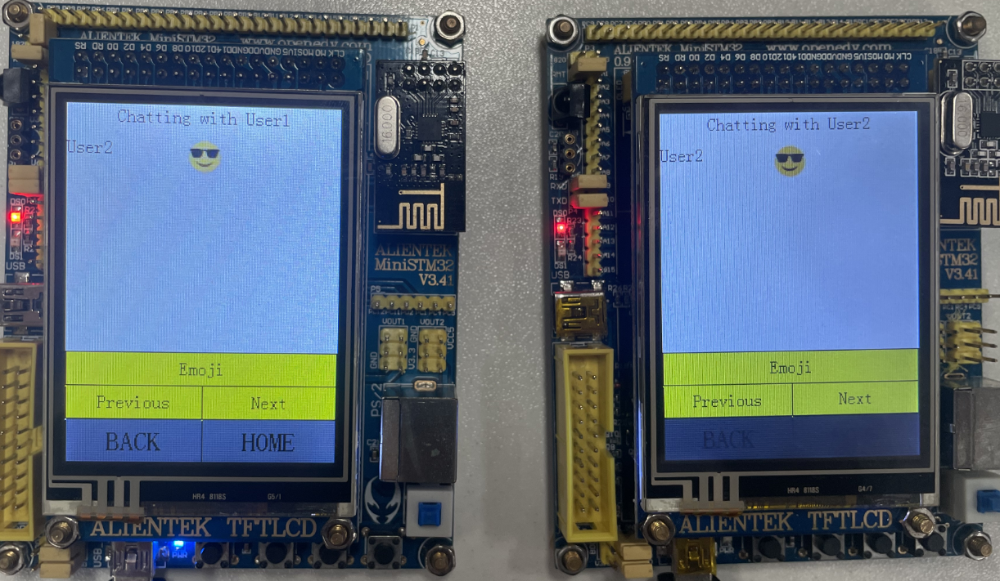
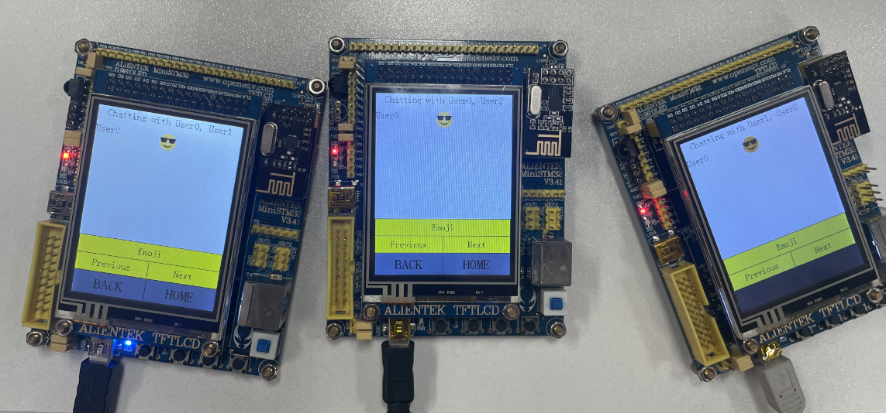
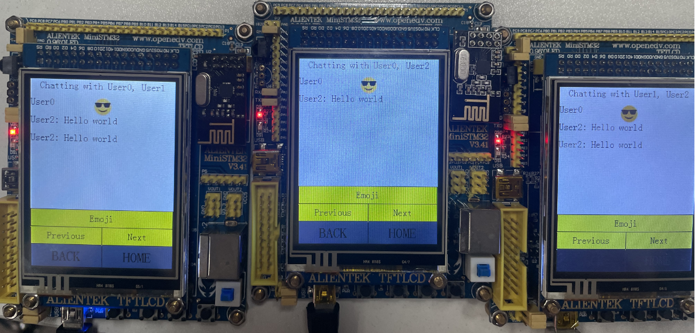
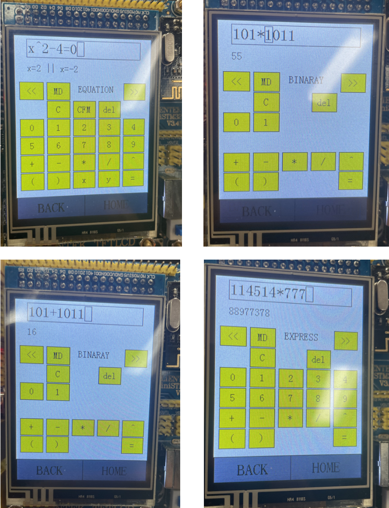
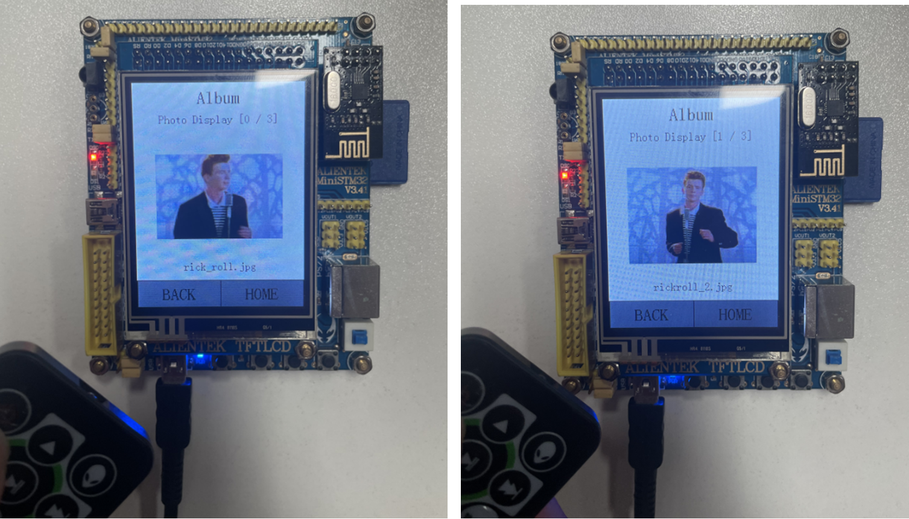

## 《Embedded System and Microcomputer Principle》Project Report

### Topic：Smartwatch based on STM32

| Member No. | SID      | NAME   | Coefficient |
| ---------- | -------- | ------ | ----------- |
| Member 1   | 12111412 | 杨宗奇 | 1           |
| Member 2   | 12111515 | 刘浩贤 | 1           |
| Member 3   | 12110104 | 冯泽欣 | 1           |
| Member 4   | 12110304 | 徐春晖 | 1           |

### System Function

我们设计了主页、聊天模块、计算器模块和相册模块，其功能如下：

#### 主页

1. 显示自启动以来经过的时间。
2. 显示该设备的用户名。
3. 输入不同的组件。

#### 聊天模块

1. 显示其他用户的在线或离线状态，并在状态发生变化时提醒用户。
2. 与单个用户或所有用户创建聊天。
3. 通过 UART 串口发送消息。
4. 提供可以发送的表情符号。
5. 同时显示消息，可通过用户名进行区分。
6. 支持断行，翻页和存储历史消息。

#### 计算器模块

1. 基本运算功能和显示。
2. 括号与指数计算功能及显示。
3. 解方程功能及其显示。
4. 二进制运算及显示。
5. 公式过长显示。
6. 基本错误检测。

#### 相册模块

1. 图片读取与显示。
2. 相册图片数量显示。
3. 红外遥控器切换图片。

### System Design

#### 工作原理

我们构建了一个基础的组件框架，所有的组件都继承自一个叫做 `display_object`（`dpo`）的根类，该组件有以下几个属性及其作用。

1. `isVisible`：当一个组件的 `isVisible` 属性为 `true` 时，表示该组件可见并具备功能。
2. `need_render`：当一个组件的 `need_render` 属性为 `true` 时，会自动刷新组件。刷新逻辑为刷新该组件及其子组件，刷新完成后会自动置为 `false`。
3. `pos`：组件相对于父组件的位置。
4. `shape`：组件的大小。
5. `click`：组件的 `click` 为 `true` 时，表示组件可被点击。

由于开发板 RAM 和 FLASH 的限制，我们在切换场景时会析构不使用的组件实例。当需要使用时，再次创建并将其加入到展示界面 `window_view` 的子组件中，并重新渲染即可使用。按钮点击事件通过判断组件的 `click` 属性来添加 `EVENT`，并在主函数的 `while` 循环中判断事件是否触发执行相应逻辑。

#### 系统框架图

#### 子模块设计

我们的系统主要划分为三个模块，分别为聊天模块，计算器模块和相册模块。

##### （1）聊天模块

点击聊天按钮会进入聊天对象选择界面，在聊天选择界面会显示有哪几个聊天对象以及聊天对象的状态。仅当聊天对象在线时，才可以发起聊天邀请；仅当两个聊天对象都在线时，才可以发起群聊邀请。点击聊天按钮时，系统会自动向被选择的聊天对象发送聊天邀请并进入聊天界面，等候聊天对象进入聊天界面。

对于聊天界面的显示方面，每一页可以容纳6条信息/表情包，采用空字符串和图像占位，输入信息后更新对应位置内容的方式显示信息。使用字符串数组和数字数组存储对应页面的信息和表情，翻页时重新更新内容。

通讯方面，每个用户每一秒钟会广播一条在线信息，格式为 `Userx:Online` 。当其他用户收到该格式的信息时，更改该用户的状态为在线，并在界面上提示该用户在线。当累计五秒没有检测到在线信息时，更改该用户状态为离线，并在界面上提示该用户离线。对于聊天功能，规定发送的信息格式为 `from:to:msg` 。当检测到to的目的用户是自己，并且自己以及进入了对应的聊天界面的时候，才将对应的信息加入到聊天框里面。

##### （2）计算器模块

计算器模块显示输入框和不同模式下对应的按钮。在执行计算后显示输出的结果。

**总体：** 不同的模式给定不同的按钮，调用输入框的输出方法来保存按钮的输入字符，从软件层面消除了完全非法的字符输入的可能。触发计算（Confirm, = 按钮）后根据模式的不同调用不同的函数，用来解析输入框目前保存的字符串，并给出一个输出。如果输入合法，给出计算结果；如果输入不合法，显示 `ERROR`。

**算法：** 计算算法函数的本质是字符串的输入输出，内部的处理过程都是封装好的，算式 parser 使用了简单的双栈结构，没有实现复杂的 tokenizer。通过对不同符号的优先级比较分析，决定符号压栈或者数字弹栈计算。十进制计算实现了`+`、`-`、`*`、`/`、`(`、`)`、`^`七个符号的功能，能按照正确的优先级进行计算。二进制计算部分则是先把二进制数字字符串转化拼接为十进制数字字符串，再调用十进制的计算算法。方程计算部分则是对标准形式（`ax^2+bx+c=0`, `a` `b`不同时为0）的算式进行处理，提取出对应的 `a` `b ` `c`，再运用一元方程的通项公式进行结果的计算和输出。

**显示：** 算式显示方面，限制算式输入长度为30，超出后将无法继续输入。`dpo` 的子框架提供了在光标处输入，光标左右移动，删除光标处字符的功能。计算器模块扩展了超长输入：在输入长于最大显示时，只显示部分算式，通过左右移动光标可以查看完整的算式内容。

##### （3）相册模块

相册模块采用了 .jpg 解析函数和正点原子的 `piclib` 来处理图像读取问题。在 SD 卡移植方面，我们使用了正点原子 SD 卡驱动方案，结合 `mmcsd` 模块和 FATFS 外部组件。

**SD卡移植：**

该方案首先采用了正点原子 SD 卡驱动方案，整合了`mmcsd` 模块和 FATFS 外部组件。在最初的移植过程中，遇到了 FLASH 爆满的问题，经检查发现其包含了巨大的 GBK 转译数组。为了解决这个问题，我们使用外部 Flash 存储了该数组以及 12、16、24 大小的 GBK 编码中文字模。尽管任务并未要求中文显示，但我们实际上支持了中文显示。

**方案：**

1. 场景初始化时，遍历 `PICTURE``文件夹下所有文件，将文件名添加至索引列表，以供后续遍历使用。

2. 初始化 `image_index` 为 0，显示第一张图片（如果没有图片则显示 `None`）。

3. 为了更方便的实现图片显示，我们在 `image` 组件下加入了索引选项。如果存在 SD 卡索引目录则加载  SD 卡中的图片，若没有则加载 `const char` 图片数组。

**遥控：**

我们使用红外遥控的 `remote` 模块，周期扫描当前按下的按键并更新 `EVENT`。通过识别对应的 `EVENT`（例如 `left`、`right`），更新`image_index`（+1、-1），从而实现对图片的切换，并更新场景。

### Results (screenshots and hardware photos)

#### 主界面

#### 聊天模块

##### （1）上线检测

#####  （2）上线 / 下线状态改变

##### （3）聊天邀请

##### （4）单人聊天

##### （5）多人聊天

#### 计算器功能（解方程，二进制计算，十进制计算）

#### 相册模块

### Work allocation description

1. Member 1: 冯泽欣, 基本框架搭建和相册模块的实现

2. Member 2: 徐春晖, 计算器模块的实现。

3. Member 3: 杨宗奇, 主页面和聊天模块接口的实现。

4. Member 4: 刘浩贤, 用户状态监测和聊天通讯功能的实现。

### Problems encountered and solutions

#### 问题 1： 

**多个组件同时存在会出现 RAM 和 FLASH 容量溢出的问题**

**解决方案：**在组件不使用时进行析构来释放内存，再次使用时重新生成组件实例，对于需要存储信息的组件，写一个析构函数来保存信息。并且将字库烧录到外置 Flash W25Qxx 中。

#### 问题2：

**在聊天通讯时频繁出现丢包或者碰撞的问题**

**解决方案：**降低发包频率，并尽量不同时进行通讯操作，降低出现丢包或者碰撞问题的可能性。

#### 问题3：

**在计算器 IO 部分，尝试直接格式化 / `std::to_string()` 输出 `double` 类型的计算结果会导致软件崩溃错误**

**解决方案：**首先研究发现可以打开 STM32 开发板浮点数 IO 的功能，为了不引入额外的软件开销，写了一个简单的字符串输出算法将接受的 `double` 类型的数据通过逐位取整逼近 `int` 的方式格式化拼接成字符串，然后输出。

### Personal proposal

#### 基础

1. 制作一个音乐播放器
2. 音乐存在 SD 卡目录下（本次 Project 实现过）
3. 拥有 LCD 进度条，暂停，切换歌曲功能（LCD 实现过）
4. 使用蜂鸣器播放音乐（需要预先处理一段音乐）可行性参考
   - [STM32F103的DAC——实现音频输出_dac生成音频-CSDN博客](https://blog.csdn.net/qq_54496810/article/details/122239610)
   - [基于STM32F103，用蜂鸣器播放歌曲_stm32f103蜂鸣器音乐-CSDN博客](https://blog.csdn.net/lintax/article/details/112754791)
5. 设备间通过2.4Ghz模块或者蓝牙模块在设备间分享音乐
   - 实现过2.4Ghz通讯，半双工即可，需要设计一套 request ack类似于计网的可信传输协议
6. 可以通过USB接口从电脑向SD卡下载音乐，参考
   - [【正点原子STM32连载】 第六十章 USB读卡器实验摘自【正点原子】STM32F103 战舰开发指南V1.2_stm32f103 usb bulk-CSDN博客](https://blog.csdn.net/weixin_55796564/article/details/131759487)

#### Bonus

1. 使用蓝牙模块（王老师有提到学校有就不再提供额外链接）与手机进行分享
2. 支持歌曲专辑封面显示（同名 .jpg 文件即可，本次实现过）
3. 更好的音质（采样、播放手段）（开放性）
4. 标准化格式音乐支持（mp3，wav，较为困难）
5. 2.4Ghz 多设备同步播放、多声道环绕音（使用 2.4G、蓝牙同步播放进度，周期同步）
